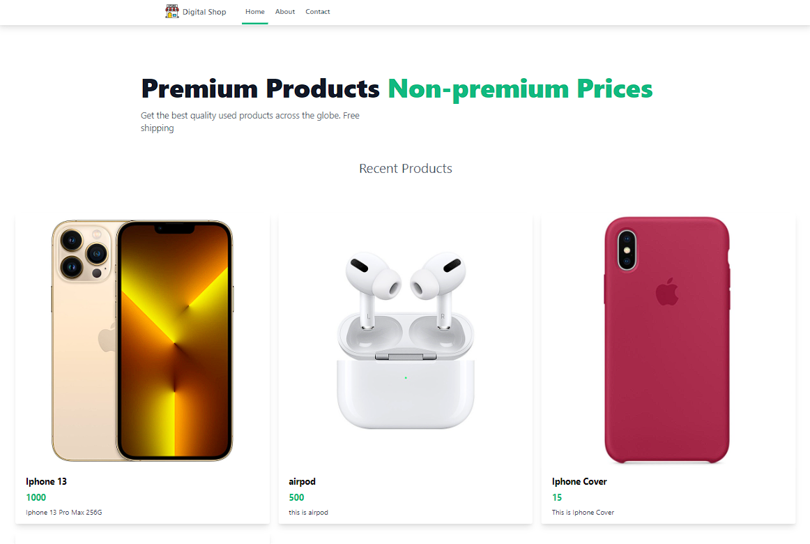

# Django Project

This is a Django project that demonstrates [brief description of your project].

## Features

- add product
- delete product
- update product
- view list and detail product

## Home Page


## Installation

1. Clone the repository:
    ```bash
    git clone https://github.com/yourusername/your-repo-name.git
    ```
2. Navigate to the project directory:
    ```bash
    cd your-repo-name
    ```
3. Create a virtual environment:
    ```bash
    python -m venv env
    ```
4. Activate the virtual environment:
    - On Windows:
        ```bash
        .\env\Scripts\activate
        ```
    - On macOS and Linux:
        ```bash
        source env/bin/activate
        ```
5. Install the dependencies:
    ```bash
    pip install -r requirements.txt
    ```
6. Apply the migrations:
    ```bash
    python manage.py migrate
    ```
7. Run the development server:
    ```bash
    python manage.py runserver
    ```

